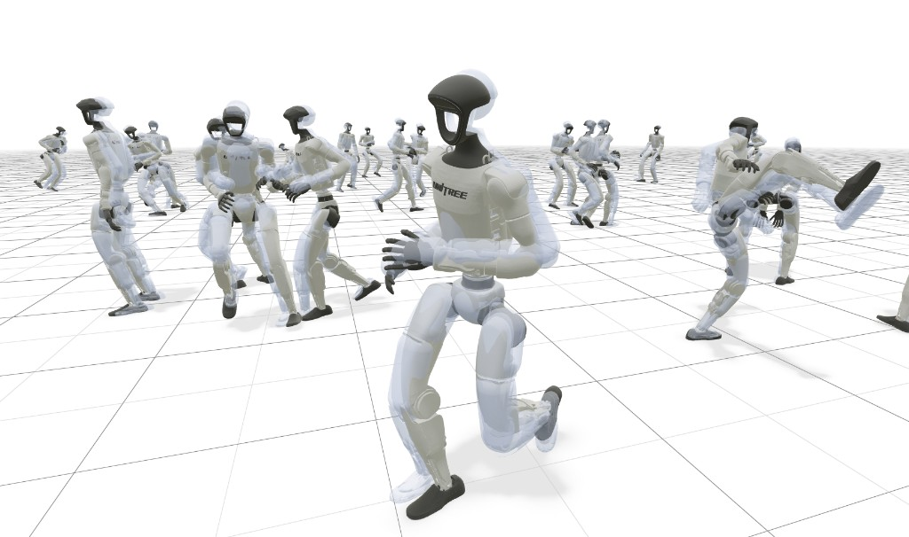
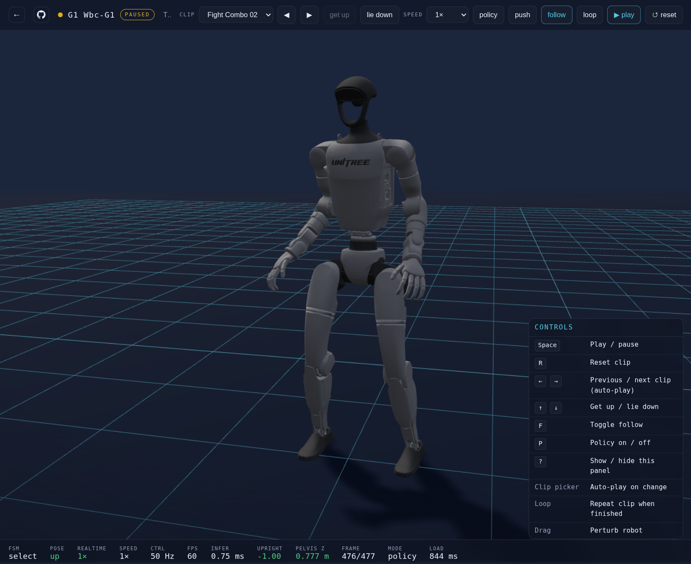

# WBC-Mjlab

**One shared MDP for whole-body motion tracking on [mjlab](https://github.com/mujocolab/mjlab).**

Built on mjlab's sim + RL stack. Recent humanoid WBC work ([ZEST](https://arxiv.org/abs/2602.00401), [BeyondMimic](https://beyondmimic.github.io/), [SONIC](https://arxiv.org/abs/2511.07820), …) tends to ship as separate codebases — **wbc-mjlab** unifies that line on **one training surface**: paper-specific choices as **`--task` switches** (RSI, observations, rewards, DR). On deploy: **one policy, many motion clips** — swap at runtime, no checkpoint change.

**Modular by design:** one shared MDP and presets in the core repo; **robots plug in** via `register_wbc_extension` in a separate package (same `wbc-mjlab-train` / play CLIs, stock `apply_wbc` preset — no fork, no new preset per robot).

  

  <a href="https://wbc-mjlab.github.io/wbc-mjlab/">Documentation</a> ·
  <a href="https://wbc-mjlab.github.io/wbc-demo/">Live demo</a> ·
  <a href="https://youtu.be/qTVkqvrJZM0">Sim rollout video</a>

## Repos

| Repo | Role |
|------|------|
| [**wbc-mjlab**](https://github.com/wbc-mjlab/wbc-mjlab) | Training — shared MDP, presets, G1 tasks, GMR PKL + batch NPZ conversion, ONNX export ([PyPI](https://pypi.org/project/wbc-mjlab/) · [docs](https://wbc-mjlab.github.io/wbc-mjlab/)) |
| [**wbc-mjlab-extension-h2**](https://github.com/wbc-mjlab/wbc-mjlab-extension-h2) | Reference **robot extension** (Unitree H2) — plug-in package via `register_wbc_extension`, no core fork |
| [**wbc-g1-deploy**](https://github.com/wbc-mjlab/wbc-g1-deploy) | Reference G1 runtime — one ONNX policy, clip library via `manifest.yaml` |
| [**wbc-demo**](https://github.com/wbc-mjlab/wbc-demo) | In-browser live demo — MuJoCo WASM + ONNX, deploy-aligned clip UX |

Upstream: [mujocolab/mjlab](https://github.com/mujocolab/mjlab) (extension, not a fork).

## One policy, many skills

The bundled deploy policy already covers **walk, jog, run, crawl, fight, get up from the floor, lie down, and flips** — selected from a clip library with the joystick.

<table>
  <tr>
    <td colspan="3" align="center">
      <b>Live demo (browser)</b> 
      
       
      MuJoCo + ONNX in the browser — idle, walk, fight, get up, lie down, … (<a href="https://wbc-mjlab.github.io/wbc-demo/">wbc-demo</a>)
    </td>
  </tr>
  <tr>
    <td colspan="3" align="center">
      <b>Unitree G1 — one policy, many skills</b> 
      <video src="assets/wbc_g1_hardware_collage.mp4" width="100%" controls></video>
       
      Get-up · idle · dance · fight · sprint · sideflip — same deploy policy, clip library switching (<a href="https://github.com/wbc-mjlab/wbc-g1-deploy">wbc-g1-deploy</a>)
    </td>
  </tr>
</table>

More skills coming (backflips, …). See [wbc-demo](https://wbc-mjlab.github.io/wbc-demo/) and [wbc-g1-deploy](https://github.com/wbc-mjlab/wbc-g1-deploy).

## Tasks, not forks

Paper knobs are **presets stacked on one MDP**, not separate codebases:

| Layer | Where | Role |
|-------|--------|------|
| **Shared MDP** | [`env/`](https://github.com/wbc-mjlab/wbc-mjlab/tree/main/src/wbc_mjlab/env) | Rewards, terminations, motion command, RSI, playback |
| **Presets** | [`presets/`](https://github.com/wbc-mjlab/wbc-mjlab/tree/main/src/wbc_mjlab/presets) | Paper recipes as functions — `apply_zest`, `apply_wbc`, `apply_binary_failure`, `apply_se_actor` |
| **Robot tasks** | [`robots/g1/tasks.py`](https://github.com/wbc-mjlab/wbc-mjlab/tree/main/src/wbc_mjlab/robots/g1/tasks.py) | Preset stacks + registered `--task` ids (`Wbc-G1`, `Wbc-G1-Zest`, …) |
| **External robots** | [wbc-mjlab-extension-h2](https://github.com/wbc-mjlab/wbc-mjlab-extension-h2) | Separate repo: MJCF + `register_wbc_extension` → `Wbc-H2` on the same MDP |

**Add a paper setup:** new preset in `presets/`, wire it in `robots/<id>/tasks.py`, register a `WbcTaskConfig` — same CLI, same log layout, comparable runs.

**Add a robot (external):** copy the [H2 extension](https://github.com/wbc-mjlab/wbc-mjlab-extension-h2) layout — robot assets, `base.py`, entry-point registration; reuse `apply_wbc` with no preset fork. Details: [documentation](https://wbc-mjlab.github.io/wbc-mjlab/) · [CONTRIBUTING.md](https://github.com/wbc-mjlab/wbc-mjlab/blob/main/CONTRIBUTING.md).

Already wired: ZEST-style rewards + reward-aligned RSI, BeyondMimic binary-failure sampling, multi-clip motion libraries, deploy-style obs export, Viser play overlays (motion context + adaptive RSI bins).

## Sim → real (G1)

1. Train / export in **wbc-mjlab** (`params/policy.onnx` + `params/config.yaml`)
2. Copy into **wbc-g1-deploy** `config/policy/`
3. Build and run `wbc_g1_ctrl` — [deploy README](https://github.com/wbc-mjlab/wbc-g1-deploy)

## What's next

Tech report, SONIC-style task, and external preset modules as separate repos.

## Status & community

Public on PyPI; APIs and tasks still evolving. Feedback, issues, and PRs welcome on any repo.
